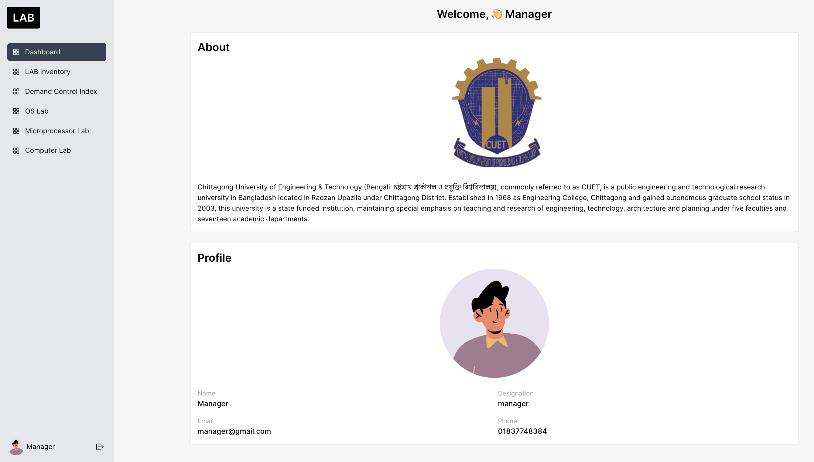
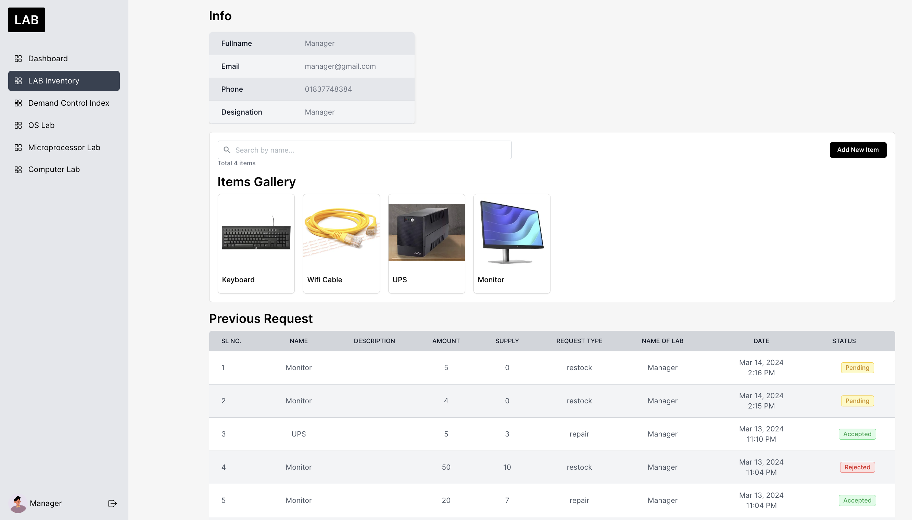
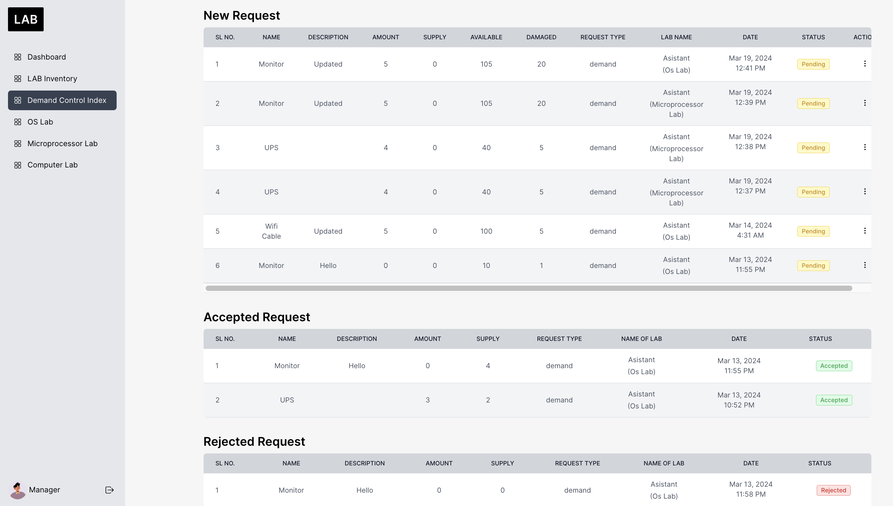
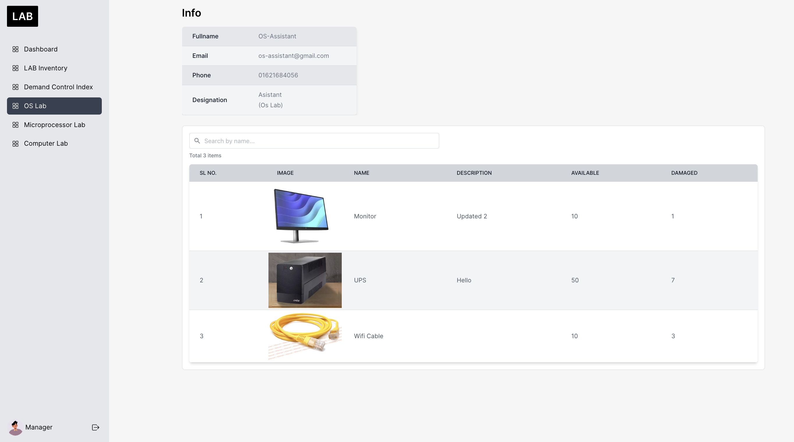

# Expense Management System

    
    
    
    

## Overview
Its a lab inventory management system. In this system there are 3 different types of role exist lab-assistent, lab-manager, admin. And also a default role is set for teacher (email:teacher@gmail.com, password:12345) to visit the lab store.  

## Features
- **Lab-Assistant**:  
    - Control all the necessary information and available product of lab
    - Add, Update and Delete items in his lab
    - Request for Restock and Repair items to manager
- **Lab-Manager**:  
    - Has main store room where all the items are avaiable and items are suppiled to individual lab
    - Add, Update and Delete items in the lab store
    - Request for Restock and Repair items to admin
- **Admin**:  
    - Control the user request and role
    - Response for Restock and Repair items
- **Dashboard**: Interactive dashboard displaying summary.
- **Multi-platform Access**: Accessible from desktop, tablet, and mobile devices for on-the-go expense management.

## Technologies Used
- **Frontend**: Next.js for server-side rendering and React for building interactive UI components.
- **Backend**: MongoDB for data storage and management.
- **Authentication**: JSON Web Tokens (JWT) for secure user authentication.
- **UI Library**: Maintine UI.
- **Styling**: Tailwind css for styling.
- **Deployment**: Hosted on vercel.

<!-- CONTACT -->
## Contact
For any inquiries or support, please contact-[Gmail](mailto:sajidislam729@gmail.com)